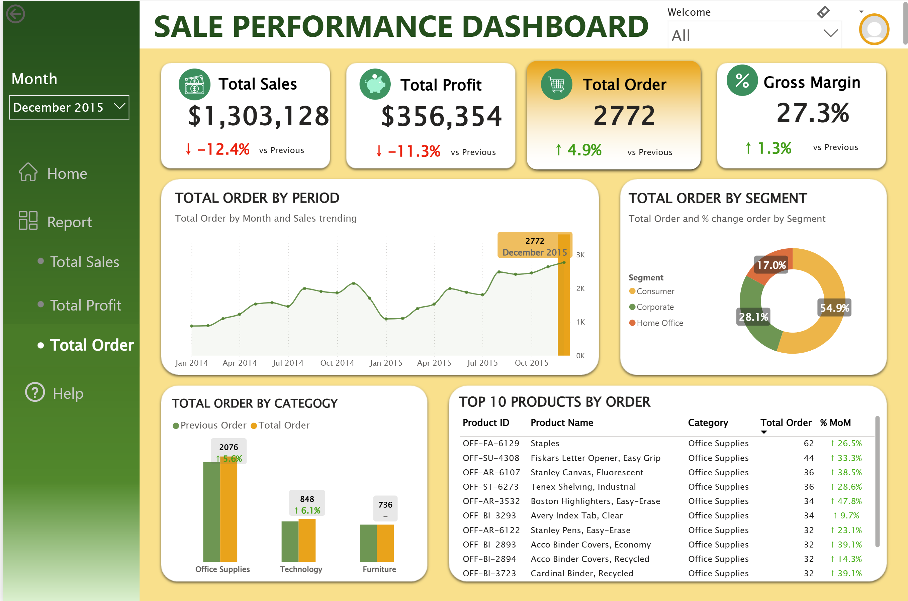

# Sales Performance Dashboard (Power BI – Global Superstore)
This repository contains an interactive Power BI dashboard analyzing key sales metrics from the Global Superstore dataset.
The dashboard focuses on Total Sales, Total Profit, Total Orders, and Gross Margin, with insights into category performance, customer segments, and top-performing products.
🔗 **Live Dashboard**: [View Power BI Report](https://app.powerbi.com/view?r=eyJrIjoiMGY3ZDFhZmUtYjU2MS00YTJkLWIyZmYtNmU0Y2Y2MzNmYzNmIiwidCI6ImVkOGYxNjczLTM4OTAtNGRiNC1hM2YwLTk3YWQ5NDI3Yzc0ZiIsImMiOjEwfQ%3D%3D)

## 📁 Dataset

**Source:** Global Superstore – Kaggle  
➡️ https://www.kaggle.com/datasets/shekpaul/global-superstore/data  

For this project, I only used the **Orders table** from the dataset, which includes:
- Order ID, Order Date, Ship Date  
- Customer, Segment, Country, City  
- Category, Sub-Category, Product Name  
- Sales, Quantity, Discount, Profit  
Other tables (e.g. Returns, People) were **not used** in this dashboard.

## 🛠 Tools
- Power BI Desktop  
- Power Query  
- DAX  
- Excel (for initial data inspection)

## 🖼 Dashboard Preview

### 🟢 Home Page  
- Title, navigation buttons, and overall performance highlight

### 🟡 Report Page  
- KPI cards for Sales, Profit, Orders, Gross Margin  
- Monthly Sales/Profit/Order trend  
- Sales/Profit/Order by Category and Segment  
- Top 10 Products by Sales/Profit/Order and MoM% change

  
  
  

## 🔍 Key Insights
- 𝗦𝗮𝗹𝗲𝘀 𝗽𝗲𝗮𝗸𝗲𝗱 𝗶𝗻 𝗡𝗼𝘃𝗲𝗺𝗯𝗲𝗿 𝟮𝟬𝟭𝟱, while 𝗽𝗿𝗼𝗳𝗶𝘁 𝗽𝗲𝗮𝗸𝗲𝗱 𝗲𝗮𝗿𝗹𝗶𝗲𝗿 𝗶𝗻 𝗢𝗰𝘁𝗼𝗯𝗲𝗿 ($𝟰𝟬𝟰𝗞), highlighting the trade-off between revenue growth and margin quality.
- From 𝗔𝘂𝗴𝘂𝘀𝘁 𝘁𝗼 𝗡𝗼𝘃𝗲𝗺𝗯𝗲𝗿, sales showed the strongest upward momentum, reflecting pre–year-end demand buildup.
- Growth during this period was largely 𝗰𝗮𝗺𝗽𝗮𝗶𝗴𝗻-𝗱𝗿𝗶𝘃𝗲𝗻 (𝗲.𝗴. 𝗕𝗹𝗮𝗰𝗸 𝗙𝗿𝗶𝗱𝗮𝘆), where increased discounting boosted volume but put 𝗽𝗿𝗲𝘀𝘀𝘂𝗿𝗲 𝗼𝗻 𝗺𝗮𝗿𝗴𝗶𝗻𝘀.
- 𝗧𝗲𝗰𝗵𝗻𝗼𝗹𝗼𝗴𝘆 consistently led revenue across months, remaining the 𝘁𝗼𝗽-𝗽𝗲𝗿𝗳𝗼𝗿𝗺𝗶𝗻𝗴 𝗰𝗮𝘁𝗲𝗴𝗼𝗿𝘆.
- The 𝗖𝗼𝗻𝘀𝘂𝗺𝗲𝗿 𝘀𝗲𝗴𝗺𝗲𝗻𝘁 contributed a larger share of total sales during year-end (~52–59%), but dropped to around ~47% in early months, indicating 𝗵𝗶𝗴𝗵𝗲𝗿 𝘀𝗲𝗻𝘀𝗶𝘁𝗶𝘃𝗶𝘁𝘆 to promotions.

## 📌 Main DAX Measures
Previous Sales = CALCULATE(
    [Total Sales],
    DATEADD('Calendar'[Order Month], -1, MONTH)
)

Max Sales = CALCULATE(
    MAXX(
        ALLSELECTED(Orders[Order Month]),
        [All Sales]
    )
)*1.3

All Sales = CALCULATE(
    [Total Sales],
    REMOVEFILTERS('Calendar'[Order Month])
)
Gross Margin = DIVIDE([Total Profit], [Total Sales])
