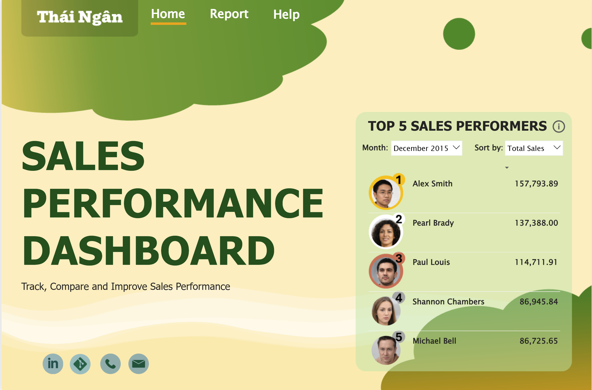
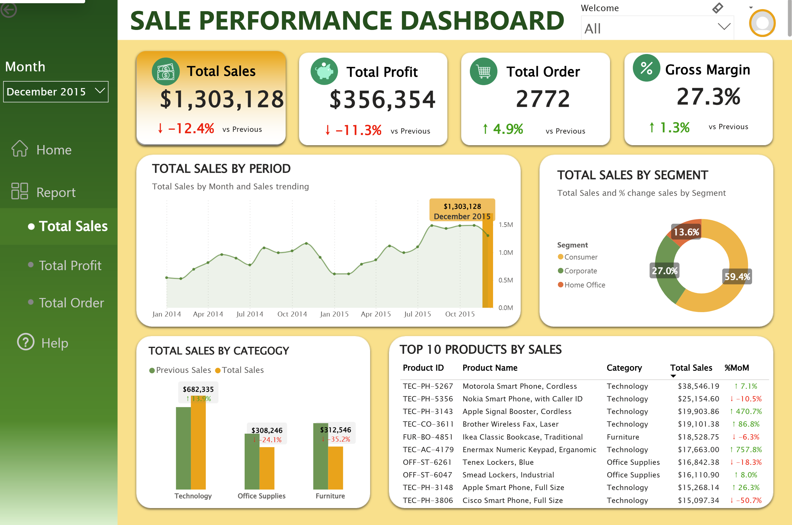

# Sales Performance Dashboard (Power BI – Global Superstore)
This repository contains an interactive Power BI dashboard analyzing key sales metrics from the Global Superstore dataset.
The dashboard focuses on Total Sales, Total Profit, Total Orders, and Gross Margin, with insights into category performance, customer segments, and top-performing products.
🔗 **Live Dashboard**: [View Power BI Report](https://app.powerbi.com/view?r=eyJrIjoiMGY3ZDFhZmUtYjU2MS00YTJkLWIyZmYtNmU0Y2Y2MzNmYzNmIiwidCI6ImVkOGYxNjczLTM4OTAtNGRiNC1hM2YwLTk3YWQ5NDI3Yzc0ZiIsImMiOjEwfQ%3D%3D)

## 📁 Dataset

**Source:** Global Superstore – Kaggle  
➡️ https://www.kaggle.com/datasets/shekpaul/global-superstore/data  

For this project, I only used the **Orders table** from the dataset, which includes:
- Order ID, Order Date, Ship Date  
- Customer, Segment, Country, City  
- Category, Sub-Category, Product Name  
- Sales, Quantity, Discount, Profit  
Other tables (e.g. Returns, People) were **not used** in this dashboard.

## 🛠 Tools
- Power BI Desktop  
- Power Query  
- DAX  
- Excel (for initial data inspection)

## 🖼 Dashboard Preview

### 🟢 Home Page  
- Title, navigation buttons, and overall performance highlight

### 🟡 Report Page  
- KPI cards for Sales, Profit, Orders, Gross Margin  
- Monthly Sales/Profit/Order trend  
- Sales/Profit/Order by Category and Segment  
- Top 10 Products by Sales/Profit/Order and MoM% change

  
  
  

## 🔍 Key Insights

## 📌 Main DAX Measures
